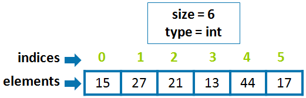
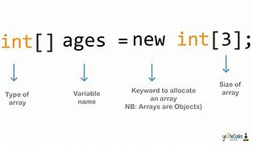

## 3.0 Table of Contents<!-- omit from toc -->

- [3.1 Session 2 Review](#31-session-2-review)
  - [3.1.1 Review of Topics](#311-review-of-topics)
  - [3.1.2 Solution to Assignment 2](#312-solution-to-assignment-2)
- [3.2 Good Programming Style](#32-good-programming-style)
  - [3.2.1 Rule #1: Naming Conventions](#321-rule-1-naming-conventions)
  - [3.2.2 Rule #2: Indentation](#322-rule-2-indentation)
  - [3.2.3 Rule #3: Whitespace](#323-rule-3-whitespace)
  - [3.2.4 Rule #4: Comments](#324-rule-4-comments)
- [3.3 Loops](#33-loops)
  - [3.3.1 `while` Loops](#331-while-loops)
  - [3.3.2 `for` Loops](#332-for-loops)
  - [3.3.3 Branching Statements](#333-branching-statements)
  - [3.3.4 Embedded Loops](#334-embedded-loops)
- [3.4 Arrays](#34-arrays)
  - [3.4.1 Declaring Arrays](#341-declaring-arrays)
  - [3.4.2 Array Initialization](#342-array-initialization)
  - [3.4.3 Array Indexing](#343-array-indexing)
- [3.5 Combine Loops and Arrays](#35-combine-loops-and-arrays)
  - [3.5.1 Example 1](#351-example-1)
  - [3.5.2 Example 2](#352-example-2)
- [3.6 Summary](#36-summary)
- [3.7 Assignment 3 - Marathon Runners](#37-assignment-3---marathon-runners)

## 3.1 Session 2 Review

### 3.1.1 Review of Topics

- Variables and Data Types
- Operators
- Type Conversion and Type Casting
- Methods and parameters
- Conditionals

### 3.1.2 Solution to Assignment 2

[View Solution](/homework#assignment-2-wage-calculator)

## 3.2 Good Programming Style

- The goal of good style is to make your code more readable by **you** and by **others**

### 3.2.1 Rule #1: Naming Conventions

Bad:

```java
String a1;
int a2;
double b;
```

Good:

```java
String firstName;
String lastName;
int age;
```

- **Use meaningful names** for variables, methods, and classes
- variable and method names should be **lowerCamelCase**
- class names should be **UpperCamelCase**

### 3.2.2 Rule #2: Indentation

Bad:

```java
public static void main(String[] args) {
int x = 5;
x = x * x;
if (x > 20) {
System.out.println("x is greater than 20");
}
}
```

Good:

```java
public static void main(String[] args) {
    int x = 5;
    x = x * x;
    if (x > 20) {
        System.out.println("x is greater than 20");
    }
}
```

- **Indentation** is important for readability
- although indentation is not required for the compiler, it is required for the **human reader**

### 3.2.3 Rule #3: Whitespace

put spaces between operators and operands

Bad:

```java
double celcius=5/9*(fahrenheit-32);
```

Good:

```java
double celcius = 5 / 9 * (fahrenheit - 32);
```

### 3.2.4 Rule #4: Comments

- **Comments** are used to explain what your code does
- they are ignored by the compiler
- denote comments with `//` for single line comments and `/* */` for multi-line comments

```java
// this is a single line comment

/* this
is
a
multi-line
comment */
```

## 3.3 Loops

```java
static void main(String[] args) {
    System.out.println("Rule #1");
    System.out.println("Rule #2");
    System.out.println("Rule #3");
    System.out.println("Rule #4");
}
```

- if I wanted to print out the rules 100 times, I would have to copy and paste the `System.out.println()` statement 100 times

- **Loops** are used to repeat a block of code
- there are two types of loops in Java: `for` loops and `while` loops

### 3.3.1 `while` Loops

```java
while (condition) {
    // code to be repeated
}
```

Example:

```java
int i = 0;
while (i < 10) {
    System.out.println("Rule #" + i);
    i++;
}
```

- the `while` loop will repeat the code inside the block as long as the condition is true
- therefore it is important to **update the condition** inside the loop and make sure that it will eventually become false
- otherwise, the loop will run forever (infinite loop)

### 3.3.2 `for` Loops

```java
for (initialization; condition; update) {
    // code to be repeated
}
```

Example:

```java
for (int i = 0; i < 10; i++) {
    System.out.println("Rule #" + i);
}
```

- `for` loops combine the initialization, condition, and update into one line, making it easier to read and write
- the `for` loop is equivalent to the `while` loop above

### 3.3.3 Branching Statements

- **Branching statements** are used to control the flow of a program
- `break` and `continue` are two branching statements that are used with loops

- `break` terminates a `for` or `while` loop

```java
for (int i = 0; i < 10; i++) {
    if (i == 5) {
        break;
    }
    System.out.println("Rule #" + i);
}
```

`continue` skips the current iteration of a loop and proceeds directly to the next iteration

```java
for (int i = 0; i < 10; i++) {
    if (i == 5) {
        continue;
    }
    System.out.println("Rule #" + i);
}
```

### 3.3.4 Embedded Loops

- **Embedded loops** are loops inside of loops
- they can also be called **nested loops**

```java
for (int i = 0; i < 10; i++) {
    for (int j = 0; j < 10; j++) {
        System.out.println("i = " + i + ", j = " + j);
    }
}
```

the variable `i` will be incremented 10 times, and for each iteration of `i`, the variable `j` will be incremented 10 times

- therefore, the code inside the inner loop will be executed 100 times
- each variable declared inside the loop is only accessible inside the loop

## 3.4 Arrays

- An array is an ordered and indexed collection of elements of the same type
- arrays are used to store multiple values in a single variable
- an array can be of any type
  - `int`
  - `double`
  - `String`
  - etc.

Example: an array of `int`s

<p style="text-align:center"></p>

### 3.4.1 Declaring Arrays

<p style="text-align:center"></p>

- arrays are declared using `TYPE[] NAME = new TYPE[SIZE]`
- they are just another type of variable
- `int[]` is an array of `int`s
- `int[][]` is an array of `int[]`s

```java
int[] numbers = new int[5];
int size = 5;
int[] numbers = new int[size];
```

### 3.4.2 Array Initialization

- curly braces `{}` are used to initialize arrays
- it can be done in two ways

```java
int[] numbers = {1, 2, 3, 4, 5};
int[] numbers = new int[] {1, 2, 3, 4, 5};
```

### 3.4.3 Array Indexing

- The index of an array starts at 0 and ends at the length of the array minus 1
- to access an element of an array, use `array[index]`

```java
int[] numbers = new int[5];
numbers[0] = 1;
numbers[1] = 2;
numbers[5] = 3; // this will cause an error
```

```java
int[] numbers = {1, 2, 3, 4, 5};
numbers[3] = 10; // this will change the value of the 4th element to 10
int x = numbers[3] + 3; // x = 13
```

- the length of an array can be accessed using `array.length`

```java
int[] numbers = {1, 2, 3, 4, 5};
int size = numbers.length; // size = 5

int[] numbers = new int[7];
int size = numbers.length; // size = 7
```

## 3.5 Combine Loops and Arrays

### 3.5.1 Example 1

```java
int[] values = new int[5];

for (int i = 0; i < values.length; i++) {
    values[i] = i;
    int y = values[i] * values[i];
    System.out.println(y);
}
```

### 3.5.2 Example 2

```java
int[] values = new int[5];
int i = 0;
while (i < values.length) {
    values[i] = i;
    int y = values[i] * values[i];
    System.out.println(y);
    i++;
}
```

## 3.6 Summary

1. Programming Style
2. Loops
3. Arrays

## 3.7 Assignment 3 - Marathon Runners

A group of students decided to run in a Marathon. Their names and finishing times are given below. Write a program that print out the name of the fastest runner.

| Name     | Time (minutes) |
| -------- | -------------- |
| Elena    | 341            |
| Thomas   | 273            |
| Hamilton | 278            |
| Suzie    | 329            |
| Phil     | 445            |
| Matt     | 402            |
| Alex     | 388            |
| Emma     | 275            |
| John     | 243            |
| James    | 334            |
| Jane     | 412            |
| Emily    | 393            |
| Daniel   | 299            |
| Neda     | 343            |
| Aaron    | 317            |
| Kate     | 265            |

**Specifications**

- Write a method that takes as input an array of integers and returns the index corresponding to the person with the lowest time. Run this method on the array of `times`. Print out the `name` and `time` corresponding to the returned index.

- Write a second method to find the second-best runner. The second method should use the first method to determine the best runner, and then loop through all values to find the second-best (second lowest) time.

**Program Skeleton**

```java
class Marathon {
    public static void main (String[] args) {
        String[] names = {
            "Elena", "Thomas", "Hamilton", "Suzie", "Phil", "Matt", "Alex",
            "Emma", "John", "James", "Jane", "Emily", "Daniel", "Neda",
            "Aaron", "Kate"
        };

        int[] times = {
            341, 273, 278, 329, 445, 402, 388, 275, 243, 334, 412, 393, 299,
            343, 317, 265
        };

        // call method to find the index of the fastest runner
        // print out the name and time of the fastest runner
        int fastestIndex = findFastestRunner(times);
        System.out.println("Fastest runner: " + names[fastestIndex] + " (" + times[fastestIndex] + " minutes)");

        // call method to find the index of the second-best runner
        // print out the name and time of the second-best runner
        int secondBestIndex = findSecondBestRunner(times);
        System.out.println("Second-best runner: " + names[secondBestIndex] + " (" + times[secondBestIndex] + " minutes)");
    }
}

```

[View Solution](/homework#assignment-3-marathon-runners)

[**Return to Top**](#30-table-of-contents)

[**Return to Main Page**](index)

