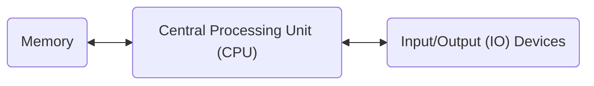

## 1.0 Table of Contents

- [1.0 Table of Contents](#10-table-of-contents)
- [1.1 Why learn Java?](#11-why-learn-java)
- [1.2 Fundamentals of the Computer](#12-fundamentals-of-the-computer)
  - [Computer Logic:](#computer-logic)
  - [CPU Instructions:](#cpu-instructions)
  - [Programming Languages](#programming-languages)
  - [Compile Java](#compile-java)

## 1.1 Why learn Java?

- Widely Used:
  - web development
  - mobile app development
  - enterprise software
  - scientific computing
  - etc
- ample resources
  - libraries
  - frameworks
  - tools for learning and building Java application
- platform independence
  - write code once
  - run on any operating system that supports Java
- Android applications
  - opportunities to develop for the Android platform
- emphasis on OOP concepts
  - object-oriented programming
  - fundamental to modern software development
- reliability
  - memory management
  - exception handling
  - help create stable and secure applications.
- good scalability
  - build applications small or large
  - enterprise-level systems
  - a versatile language

<p style="text-align:center"></p>

## 1.2 Fundamentals of the Computer

### Computer Logic:



### CPU Instructions:

```java
z=x+y;
```

```
LOAD x
ADD  y
STORE z
```

### Programming Languages

- High-level languages
  - Java
  - Python
  - C++
  - C#
  - etc
- wasier to understand than assembly
- must be translate to machine code to run

### Compile Java

- Java is a compiled language
- Java source code is compiled into bytecode

```mermaid
flowchart LR;
  A[Java Source Code (.java)] --> B[Java Compiler (javac)] --> C[Bytecode (.class)] --> D[Java Virtual Machine (java)];
```
